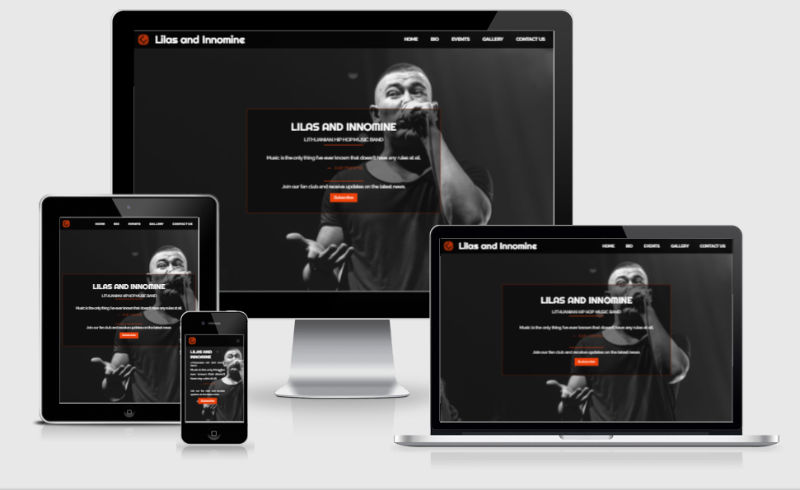

<h1 align="center">Lilas and Innomine landing page</h1>

[View the live project here.]("")

This landing page is for current and potential "Lilas and Innomine" band fans. This sites' purpose is to offer more information in one place to the fans about band members, their music, upcoming show and to be accessible on a range of devices with a responsive design. "Lilas and Innomine" page gives an option to a user to buy bands' released albums/songs and book tickets to upcoming shows.

<h2 align="center"></h2>

## User Experience (UX)

- ### User stories

    -   #### First Time Visitor Goals

        1. As a First Time Visitor, I want to easily understand the main purpose of the site and learn more about the band. 
        2. As a First Time Visitor, I want to be able to easily navigate throughout the site to find content.
        3. As a First Time Visitor, I want to listen to the songs and see if I like the band.
        4. As a First Time Visitor, I want to check their social media channels to see how popular they are and what other people think about their music.

     -  #### Returning Visitor Goals

        1. As a Returning Visitor, I want to check if there are any upcoming events that would interest me.
        2. As a Returning Visitor, I want to find more band-released songs and music videos.
        3. As a Returning Visitor, I want to find the best way to contact representatives of the band to answer my other queries.

    -   #### Frequent User Goals

        1. As a Frequent User, I want to check if there are any new albums released.
        2. As a Frequent User, I want to check on bands upcoming music events.
        3. As a Frequent User, I want to sign up to the newsletter so that I am emailed about bands' newly released content.

- ### Design

    -   #### Colour scheme
        - There is three main colors on Lilas and Innomine page black, white and orange.
    -   #### Typography
        - Throughout the whole website were used two fonts Raleway for all general text and Righteous for all headings. For both fonts used a Sans-Serif fallback font in case other fonts won't be imported.
    -   #### Imagery
        - Images used on page are very importasn. Starting from background hero image, to give visistor a feeling what this page is about. Goint through the page there is more images than text content, because it's easier to present band with images than text. 

- ### Wireframes

    - Landing page desktop wireframe - [View](assets/testing-user-stories/desktop-wireframe.png)

    - Landing page mobile wireframe - [View](assets/testing-user-stories/mobile-wireframe.jpg)

## Features

- ### Existing Features
    - Responsive on all devices

    - All content displayed on one page.
        - You can navigate through page sections with navigation bar. (On mobile devices navigation display throught expandable list "Burger icon")
        - On page right bottom side there is a button to go back to top, displayed after user scroll down page 400px.

    - Page divided into six sections
        - Landing page "hero image" is focused on giving the impression of what page content is about. It has call out text and call to action button to subscirbe for latest band news.
        - The New releases section is to provide users/fans with the latest band news (Latest songs/albums and music videos).
        - The Biography article is to give short summary about the band.
        - The Events section have information about upcoming events and link to book a ticket (Location, date and price).
        - The Gallery section showcases the bands' activities. It will provide the user with supporting images to see what the band's events look like before participating in them.
        - The contact section provides bands' contact details followed by social media links. A section has a form for users to fill in if they have any queries.

- ### Features to Implement
    - A music player with the bands newest album/song list.
    - A section/page were fans could buy bands merchandise.
    - Add forum/blog section to give users/fans to share their opinion about the band.
    - An option for users to watch bands' performances live.

## Technologies Used

- ### Languages Used

    - [HTML5](https://en.wikipedia.org/wiki/HTML5)
    - [CSS3](https://en.wikipedia.org/wiki/Cascading_Style_Sheets)

- ### Frameworks, Libraries & Programs Used

    1. [Bootstrap 5.0:](https://getbootstrap.com/docs/5.0/getting-started/introduction/)
        - Bootstrap was used to assist with the responsiveness and styling of the website.
    2. [Google Fonts](https://fonts.google.com/)
        - Google fonts were used to import the 'Raleway' and 'Righteous' fonts into the style.css file which is used on all pages throughout the project.
    3. [Font Awesome](https://fontawesome.com/)
        - Font Awesome was used on all pages throughout the website to add icons for aesthetic and UX purposes.
    4. [jQuery:](https://jquery.com/)
        - jQuery came with Bootstrap to make the navbar responsive but was also used for the smooth scroll function in JavaScript.
    5. [w3schools](https://www.w3schools.com/howto/tryit.asp?filename=tryhow_js_scroll_to_top)
        - Embed a javascript code from w3school to make back to top button.
    6. [Hubspot](https://blog.hubspot.com/website/hide-scrollbar-css)
        - Add code into style.css to hide scrollbar from page to make viewport more aesthetic.
    7. [CodePen](https://codepen.io/)
        - Web application to test code snippets.
    8. [Git](https://git-scm.com/)
        - Git was used for version control by utilizing the Gitpod terminal to commit to Git and Push to GitHub.
    9. [GitHub:](https://github.com/)
        - GitHub is used to store the projects code after being pushed from Git.
    10. [Pinterest](https://www.pinterest.se/fromupnorth/web-design/)
        - Used to get inspiration to create a landing page layout.
    11. [Adobe-Affinity](https://affinity.serif.com/en-gb/photo/)
        - Used to style logo, edit pohtos and resize images for webpages.
    12. [Eagleget](https://eagle.cool/)
        - Image managing extension for browsers. Makes easy to sort huge amount images used for creating webpage.
    13. [Figma](https://www.figma.com/)
        - Used to create a wireframe / layout for a web page.
    
## Testing

 - The W3C Markup Validator and W3C CSS Validator Services were used to validate landing page of the project to ensure there were no syntax errors in the project.

    - [W3C Markup Validator](https://jigsaw.w3.org/css-validator/#validate_by_input) - [Results](assets/testing-user-stories/html-validator.png)
    - [W3C CSS Validator](https://jigsaw.w3.org/css-validator/#validate_by_input) - [Results](assets/testing-user-stories/css-validation-service.png)

- ### Testing User Stories from User Experience (UX) Section

    - #### First Time Visitor Goals

        1.  As a First Time Visitor, I want to easily understand the main purpose of the site and learn more about the band. 
            1. Upon entering the site, users are automatically greeted with navigation bar, that contains all the sections of the page.
            2. Underneath there is one of the bands singers profile pictures as a hero image thats gives user a sense what is this web page about.
            3. [Preview](assets/testing-user-stories/page-top-section.png)
        
        2. As a First Time Visitor, I want to be able to easily be able to navigate throughout the site to find content.
            1. At the top of each page there is a navigation bar, each link name describes the sections content of the page. [Navigation on medium and bigger screens](assets/testing-user-stories/nav-bar-desk.png), [Navigation on mobile devices](assets/testing-user-stories/nav-bar-mobile.png)
            2. The user has two options go throuth the page, first throught navigation bar usiong call to action button or using scroll bar, scrolling thought the page content.
            2. The page has call to action button on the bottom right side of the page to go back to the top of the page. [Bac to top btn](assets/testing-user-stories/back-to-top-btn.png)

        3. As a First Time Visitor, I want to listen to the songs and see if I like the band.
            1. At the navigation bar through call to action button users can check on bands' newest albums, videos and get access to bands' song playlists on the most popular media service libraries. [News section](assets/testing-user-stories/new-releases.png)
            2. The biography section gives a user a short introduction about the band itself and its achievements. [Bio](assets/testing-user-stories/biography.png)
            2. Gallery section gives a new user an image of what band performances are like and if they want to be part of it. [Gallery](assets/testing-user-stories/gallery.png)
        
        4. As a First Time Visitor, I want to check their social media channels to see how popular they are and what other people think about their music.
            1. On the news section users by listening to bands playlists on media services can check how many fans band has. [Preview](assets/testing-user-stories/latest-songs-links.png) 
            2. At the bottom of the page user can find links to social media and get more information about band. [Social media links](assets/testing-user-stories/social-media-links.png)

    - #### Returning Visitor Goals

        1. As a Returning Visitor, I want to find more band-released songs and music videos.
            1. News section provides all the newest information about bands' released songs, albums or music videos. [News section](assets/testing-user-stories/new-releases.png)
            2. Page has links to to media services where they can listen all latest songs/hits. [Media libarary](assets/testing-user-stories/latest-songs-links.png)

        2. As a Returning Visitor, I want to check if there are any upcoming events that would interest me.
            1. Navigation has call to action button that brings user to Events section where user can check on upcoming events. [Events section](assets/testing-user-stories/events-section.png)
        
        3. As a Returning Visitor, I want to find the best way to contact representatives of the band to answer my other queries.
            1. Navigation bar has a menu list option to go to page contacts section. [Navigation](assets/testing-user-stories/nav-bar-desk.png)
            2. Contact section has details needed to contact band support. [Contact details](assets/testing-user-stories/social-media-links.png)
            3. The contact section has a form that the user can fill in with any queries user has and will get a reply through email. [Form](assets/testing-user-stories/queries-form.png)

    - #### Frequent User Goals

        1. As a Frequent User, I want to check if there are any new albums released.
            1. Users can always find the latest albums in the new releases section and have an option to purchase them through the link. [News section](assets/testing-user-stories/new-releases.png)

        2. As a Frequent User, I want to check on bands upcoming music events. 
            1. Users can get access to the events section through the navigation bar. [Navigation](assets/testing-user-stories/nav-bar-desk.png)
            2. Event section display all upcoming events with followed information (Name of event, date, location, price) and a link where the user can book a ticket. [Events section](assets/testing-user-stories/events-section.png)
            3. If users have any queries about events, there is a link at the bottom of the section that brings the user to the contact us part, where the user can fill in any queries he has. [Link](assets/testing-user-stories/events-contact-us-link.png)

        3. As a Frequent User, I want to sign up to the newsletter so that I am emailed about bands' newly released content.
            1. Users can subscribe to the newsletter upon entering the landing page. There is call to action button in the middle of the viewport. [Preview](assets/testing-user-stories/page-top-section.png), [Newsletter form](assets/testing-user-stories/sign-up-form.png)
        
- ### Further Testing

    - The Website was tested on Google Chrome, Microsoft Edge and Firefox.
    - Used google chrome dev tools Lighthouse.
    - The website was tested on different devices: Desktop, Laptop, Samsung Galaxy A21s, Samsung Galaxy S7 and Samsung Galaxy Tab S2.
    - Navigation bar functionality was tested that all call to action buttons was working correctly.
    - Tested all links used on the page to outside pages would open correctly and on the new tab.
    - Tested both forms (subscirbe to newsletter/contatcs-us) on the page.
        - Tested call to action button to call pop up modal form.
        - Tested input fields that correct information would be inserted, if not, display an error message.
        - Test submit button after all fields are filled with the right information.
    - Tested latest music video iframe if video is with sound and playing.

- ### Bugs 

    - Most of the encountered bugs were related to missed tags, semicolons, or typing mistakes.
    - Fix few bugs where class names were mixed up or used in the wrong places.

- ### Known Bugs

    - While scrolling through a page on a mobile device or tablet the background images adjust itself / move.

## Deployment

